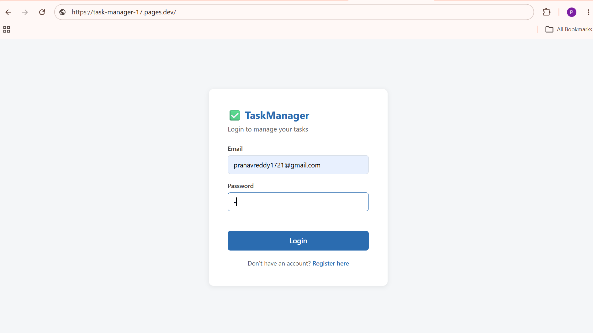
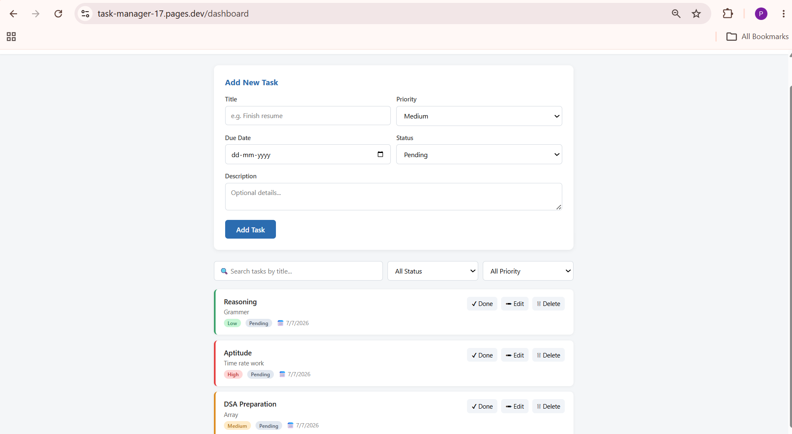

<div align="center">

<!-- Banner -->


<br/>

<!-- Badges -->
<p>
  
  
  
  
</p>
<p>
  
  
  
  
  
</p>

<br/>

> **A full-stack task management web app —**
> secure JWT authentication, complete CRUD operations, and a clean, framework-free frontend, deployed live end to end.

<br/>

[🚀 Live Demo](https://task-manager-17.pages.dev/) &nbsp;•&nbsp; [📖 API Docs](#-api-endpoints) &nbsp;•&nbsp; [🐛 Report Bug](https://github.com/pranavreddy1721/task-manager/issues) &nbsp;•&nbsp; [💡 Request Feature](https://github.com/pranavreddy1721/task-manager/issues)

</div>

---

## 📋 Table of Contents

- [✨ Features](#-features)
- [📸 Screenshots](#-screenshots)
- [🛠️ Tech Stack](#️-tech-stack)
- [🗂️ Project Structure](#️-project-structure)
- [🗄️ Database Schema](#️-database-schema)
- [🔌 API Endpoints](#-api-endpoints)
- [🔐 Authentication Flow](#-authentication-flow)
- [⚙️ Environment Variables](#️-environment-variables)
- [🚀 Getting Started](#-getting-started)
- [☁️ Deployment](#️-deployment)
- [🔒 Security Features](#-security-features)
- [🗺️ Roadmap](#️-roadmap)
- [🤝 Contributing](#-contributing)

---

## ✨ Features

<table>
<tr>
<td width="50%">

### 🔐 Authentication
- Register with name, email, password
- Passwords hashed with **bcrypt** (never stored in plain text)
- JWT issued on login/register, valid for 30 days
- Protected routes — only accessible with a valid token
- Auto-redirect to login if session is missing/expired

</td>
<td width="50%">

### ✅ Task Management (CRUD)
- Create tasks with title, description, priority, due date
- Read — view all tasks, scoped to the logged-in user only
- Update — edit details or toggle Pending/Completed
- Delete — remove tasks with a confirmation prompt

</td>
</tr>
<tr>
<td width="50%">

### 🔍 Search & Filter
- Real-time search by task title
- Filter by status: Pending / Completed
- Filter by priority: Low / Medium / High
- Filters combine — search + status + priority together

</td>
<td width="50%">

### 🎨 Clean UI
- Priority-coded left border on task cards (Low/Medium/High)
- Status & priority badges
- Responsive layout, works on mobile and desktop
- No frameworks — pure HTML, CSS, and JavaScript

</td>
</tr>
</table>

---

## 📸 Screenshots

<table>
<tr>
<td align="center" width="50%">

<br />
<sub><b>Login Page</b></sub>
</td>
<td align="center" width="50%">

<br />
<sub><b>Task Dashboard</b></sub>
</td>
</tr>
</table>

---

## 🛠️ Tech Stack

### 🖥️ Frontend

| Technology | Purpose |
|---|---|
|  **HTML5** | Page structure — Login, Register, Dashboard |
|  **CSS3** | Custom styling, no UI framework, responsive layout |
|  **JavaScript (ES6+)** | DOM manipulation, form handling, API calls |
| **Fetch API** | HTTP requests to the backend, with JWT header attached |
| **localStorage** | Persists JWT token & user info across page reloads |

### ⚙️ Backend

| Technology | Purpose |
|---|---|
|  **Node.js** | JavaScript runtime |
|  **Express.js** | REST API framework, routing, middleware |
| **bcryptjs** | Password hashing (salted) |
| **jsonwebtoken** | JWT generation & verification (30-day expiry) |
| **cors** | Allows the frontend (different origin) to call the API |
| **dotenv** | Loads environment variables from `.env` |
| **Nodemon** | Auto-restart server on file change (dev only) |

### 🗄️ Database

| Technology | Purpose |
|---|---|
|  **MongoDB Atlas** | Cloud-hosted NoSQL database |
| **Mongoose** | ODM — schemas, validation, queries |

### ☁️ Deployment

| Layer | Platform |
|---|---|
| Backend API |  **Render** |
| Frontend | **Cloudflare Pages** |
| Database | **MongoDB Atlas** |

---

## 🗂️ Project Structure

```
task-manager/
├── backend/
│   ├── config/
│   │   └── db.js                    # MongoDB connection
│   ├── models/
│   │   ├── User.js                  # User schema + password hashing hook
│   │   └── Task.js                  # Task schema
│   ├── middleware/
│   │   └── authMiddleware.js        # JWT verification (protect routes)
│   ├── controllers/
│   │   ├── authController.js        # Register, login, profile
│   │   └── taskController.js        # Create, read, update, delete tasks
│   ├── routes/
│   │   ├── authRoutes.js            # /api/auth/*
│   │   └── taskRoutes.js            # /api/tasks/*
│   ├── server.js                    # App entry point
│   ├── package.json
│   └── .env.example
├── frontend/
│   ├── index.html                   # Login page
│   ├── register.html                # Register page
│   ├── dashboard.html                # Task dashboard (CRUD UI)
│   ├── css/
│   │   └── style.css
│   └── js/
│       ├── api.js                   # Fetch wrapper + JWT header
│       ├── auth.js                  # Login/register logic
│       └── dashboard.js             # CRUD + filter logic
├── screenshots/
│   ├── login-screenshot.png
│   └── dashboard-screenshot.png
├── JWT_GUIDE.md                     # JWT concepts + interview Q&A
└── README.md
```

---

## 🗄️ Database Schema

### 👤 User
```
User {
  name       String   — Required
  email      String   — Required, unique, lowercase
  password   String   — bcrypt hashed (10 salt rounds), min 6 chars
  createdAt  Date
  updatedAt  Date
}
```

### ✅ Task
```
Task {
  user         ObjectId → User   — Owner of this task
  title        String   — Required
  description  String   — Optional
  priority     Enum     — Low | Medium | High (default: Medium)
  dueDate      Date     — Optional
  status       Enum     — Pending | Completed (default: Pending)
  createdAt    Date
  updatedAt    Date
}
```

---

## 🔌 API Endpoints

Base URL (production): `https://task-manager-api-ie3z.onrender.com/api`

### 🔐 Auth — `/api/auth`

| Method | Endpoint | Auth | Description |
|:---:|---|:---:|---|
| `POST` | `/register` | ❌ | Register a new user, returns JWT |
| `POST` | `/login` | ❌ | Login, returns JWT |
| `GET` | `/profile` | ✅ | Get logged-in user's profile |

### ✅ Tasks — `/api/tasks`

| Method | Endpoint | Auth | Description |
|:---:|---|:---:|---|
| `POST` | `/` | ✅ | Create a new task |
| `GET` | `/` | ✅ | Get all tasks (`?search=`, `?status=`, `?priority=`) |
| `GET` | `/:id` | ✅ | Get a single task |
| `PUT` | `/:id` | ✅ | Update a task |
| `DELETE` | `/:id` | ✅ | Delete a task |

> Protected routes require header: `Authorization: Bearer <token>`

---

## 🔐 Authentication Flow

```
1. User registers/logs in
2. Server verifies password (bcrypt) and signs a JWT
3. Frontend stores the token in localStorage
4. Every task request sends: Authorization: Bearer <token>
5. Backend middleware verifies the token before granting access
6. Tasks are filtered by user ID — each user only sees their own data
```

📄 For a full breakdown with interview-style Q&A, see **[JWT_GUIDE.md](./JWT_GUIDE.md)**.

---

## ⚙️ Environment Variables

Create a `.env` file inside `backend/`:

```env
# ── MongoDB Atlas ─────────────────────────────────────────────
# Get from: https://cloud.mongodb.com → Connect → Drivers
MONGO_URI=mongodb+srv://<user>:<password>@cluster0.xxxxx.mongodb.net/taskmanager?appName=Cluster0

# ── JWT ───────────────────────────────────────────────────────
# Use any long random string
JWT_SECRET=your_super_secret_jwt_key

# ── Server ────────────────────────────────────────────────────
PORT=5000
```

> ⚠️ **Never commit `.env` files to Git.** They are already in `.gitignore`.

---

## 🚀 Getting Started

### Prerequisites

```bash
node -v   # v18 or higher
npm -v    # v9 or higher
```

### 1. Clone the repository

```bash
git clone https://github.com/pranavreddy1721/task-manager.git
cd task-manager
```

### 2. Backend setup

```bash
cd backend
npm install
cp .env.example .env    # then fill in your values (see above)
npm run dev
```

Runs on `http://localhost:5000`

### 3. Frontend setup

```bash
cd ../frontend
npx http-server -p 5500
```

Visit `http://localhost:5500`

> ⚠️ If running the frontend locally against the local backend, update `API_BASE_URL` in `frontend/js/api.js` to `http://localhost:5000/api`.

---

## ☁️ Deployment

| Layer | Platform | Live URL |
|---|---|---|
| Frontend | Cloudflare Pages | [task-manager-17.pages.dev](https://task-manager-17.pages.dev/) |
| Backend API | Render | [task-manager-api-ie3z.onrender.com](https://task-manager-api-ie3z.onrender.com) |
| Database | MongoDB Atlas | — |

> ℹ️ Render's free tier spins down after inactivity — the first request after idling may take 30–50 seconds to respond.

---

## 🔒 Security Features

| Feature | Implementation |
|---|---|
| **Password hashing** | bcrypt with salted hashing before every save |
| **JWT tokens** | Signed with server-only secret, 30-day expiry |
| **Protected routes** | Middleware verifies token on every task request |
| **User-scoped data** | Tasks filtered by `user` ID — no cross-user access |
| **CORS** | Enabled so only intended frontend origins can call the API |
| **Environment secrets** | `.env` excluded from Git via `.gitignore` |

---

## 🗺️ Roadmap

- [ ] Task categories/tags
- [ ] Due-date sorting and reminders
- [ ] Pagination for large task lists
- [ ] Dark mode toggle
- [ ] Email verification on signup

---

## 🤝 Contributing

Contributions are welcome!

```bash
# 1. Fork the repo
# 2. Create your feature branch
git checkout -b feature/AmazingFeature

# 3. Commit your changes
git commit -m 'Add some AmazingFeature'

# 4. Push to the branch
git push origin feature/AmazingFeature

# 5. Open a Pull Request
```

---

## 📄 License

Distributed under the MIT License. See `LICENSE` for more information.

---

<div align="center">

**Built with ❤️ by [Pranav Reddy](https://github.com/pranavreddy1721)**


</div>
